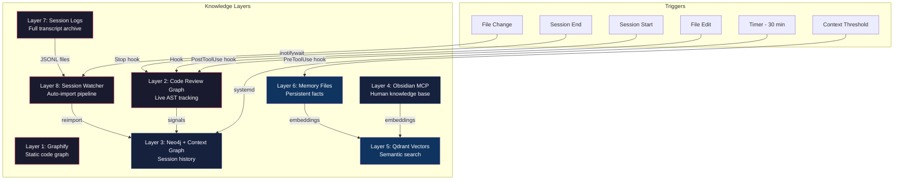

# 8-Layer Knowledge Graph for AI Coding Assistants

> A persistent, multi-layered knowledge system that gives AI coding assistants (like Claude Code) long-term memory, cross-session context, and structured understanding of your codebase.

<p align="center">
  
  <br>
  <em>A real knowledge graph generated by this system — each color is a detected community of related concepts</em>
</p>

## The Problem

AI coding assistants lose context. Every new session starts from scratch. Long conversations get compacted. Knowledge about your project's architecture, decisions, and history lives in your head — not in the assistant's context.

**What if your AI assistant could remember everything?**

This architecture solves that with 8 complementary knowledge layers that capture different types of information, auto-update during normal development, and persist across sessions indefinitely.

## Architecture Overview



## The 8 Layers

| # | Layer | What It Captures | Storage | Update |
|---|-------|-----------------|---------|--------|
| 1 | **Graphify** | Full codebase knowledge graph with community detection | `graphify-out/` JSON + HTML | Manual (`/graphify .`) |
| 2 | **Code Review Graph** | Live AST — functions, classes, imports, call relationships | SQLite (`.code-review-graph/`) | Auto (hooks on every edit) |
| 3 | **Neo4j + Context Graph** | Session history, topics discussed, tools used, cross-session links | Neo4j Docker volumes | Auto (timer + watcher) |
| 4 | **Obsidian MCP** | Human-written notes, architecture docs, decision records | Obsidian vault + basic-memory index | Auto (SSE daemon watches vault) |
| 5 | **Qdrant Vectors** | Semantic embeddings of notes + memory for similarity search | Qdrant local storage | Manual (seed script) |
| 6 | **Memory Files** | Persistent facts: user preferences, project context, feedback | Markdown files with frontmatter | Auto (Claude's auto-memory) |
| 7 | **Session Logs** | Full JSONL transcripts of every coding session | JSONL files on disk + HTTP server | Auto (Claude Code writes them) |
| 8 | **Session Watcher** | File change detection that triggers Neo4j reimport pipeline | inotifywait + systemd | Auto (watches for new sessions) |

## Why 8 Layers?

Each layer captures a type of knowledge the others miss:

- **Graphify** finds cross-file connections and community structure that live AST tracking can't see (it needs the full picture)
- **Code Review Graph** tracks real-time changes that Graphify's static snapshot doesn't update for
- **Neo4j** preserves session-level context (what was discussed, what decisions were made) that code graphs don't capture
- **Obsidian** holds human knowledge that doesn't exist in code — architecture rationale, business context, decision records
- **Qdrant** enables semantic search ("find things related to authentication") across all text content
- **Memory Files** persist specific facts between sessions when conversation context gets compacted
- **Session Logs** are the raw archive — nothing is lost, ever
- **Session Watcher** closes the loop by automatically importing new sessions into Neo4j

See [docs/why-8-layers.md](docs/why-8-layers.md) for the full design rationale.

## Auto-Update Pipeline

The key innovation is that **6 of 8 layers update automatically** during normal development — no manual maintenance required.

```
Developer edits file
    │
    ├── PostToolUse hook fires
    │       ├── code-review-graph updates (AST)
    │       └── signals Neo4j reimport
    │
    ├── Session JSONL grows
    │       └── inotifywait detects change
    │               └── debounced Neo4j reimport
    │
    ├── 30-minute systemd timer
    │       └── Neo4j reimport (catches anything missed)
    │
    └── Context approaching compaction threshold
            └── PreToolUse hook prompts knowledge dump to memory files
```

Only **2 layers need manual updates:**
- **Graphify** — Run `/graphify .` when you want a fresh full-codebase snapshot
- **Qdrant** — Run the seed script after adding new Obsidian notes or memory files

See [diagrams/auto-update-pipeline.md](diagrams/auto-update-pipeline.md) for the full trigger chain.

## Quick Start

See the [Setup Guide](docs/setup-guide.md) for full instructions. The short version:

```bash
# 1. Clone this repo for the config templates
git clone https://github.com/davidsly4954/second-brain-architecture.git
cd second-brain-architecture

# 2. Start Neo4j
docker compose -f configs/docker-compose.yml up -d

# 3. Install systemd timers
cp configs/systemd/*.service configs/systemd/*.timer ~/.config/systemd/user/
systemctl --user daemon-reload
systemctl --user enable --now neo4j-reimport.timer

# 4. Configure MCP servers
cp configs/mcp-servers.example.json /path/to/your/project/.mcp.json
# Edit with your paths and credentials

# 5. Install hooks
cp configs/hooks/*.sh /path/to/your/project/.claude/hooks/
# Wire them into .claude/settings.json
```

## Tech Stack

| Component | Tool | Role |
|-----------|------|------|
| Code graph | [graphify](https://github.com/safishamsi/graphify) | Static codebase knowledge graph |
| Live AST | [code-review-graph](https://github.com/tirth8205/code-review-graph) | Real-time code structure tracking |
| Graph DB | [Neo4j Community](https://neo4j.com/) | Session history + cross-references |
| Context graph | [create-context-graph](https://github.com/neo4j-labs/create-context-graph) | PydanticAI session importer |
| Notes index | [basic-memory](https://github.com/basicmachines-co/basic-memory) | Obsidian vault MCP server |
| Vector DB | [Qdrant](https://qdrant.tech/) | Semantic similarity search |
| Log server | [claude-code-logs](https://github.com/fabriqaai/claude-code-logs) | HTTP access to session transcripts |
| Session watch | inotifywait (inotify-tools) | File change detection |
| Orchestration | systemd user services | Timer-based automation |
| AI assistant | [Claude Code](https://claude.ai/code) | The AI that uses all of this |

## Project Structure

```
second-brain-architecture/
├── README.md                          # You are here
├── architecture.md                    # Deep dive into each layer
├── diagrams/
│   ├── architecture-overview.md       # Mermaid: all 8 layers
│   ├── data-flow.md                   # Mermaid: data movement
│   └── auto-update-pipeline.md        # Mermaid: hook trigger chain
├── configs/
│   ├── mcp-servers.example.json       # MCP server configuration
│   ├── docker-compose.yml             # Neo4j Docker setup
│   ├── systemd/                       # 5 systemd unit files
│   └── hooks/                         # 3 Claude Code hook scripts
├── scripts/
│   ├── seed-vectors.py                # Qdrant vector seeder
│   └── watch-sessions.sh              # Session file watcher
└── docs/
    ├── why-8-layers.md                # Design rationale
    ├── setup-guide.md                 # Step-by-step setup
    ├── recommended-setup.md           # Hardware, 24/7 ops, reboot recovery
    └── lessons-learned.md             # What worked and didn't
```

## Lessons Learned

Building this system taught us several things the hard way. See [docs/lessons-learned.md](docs/lessons-learned.md) for the full story, but the highlights:

- **SSE vs stdio for MCP daemons** — If your MCP server runs as a systemd daemon (not connected to a client), it must use SSE or streamable-http transport. stdio needs a connected client on stdin/stdout — without one, it exits immediately and systemd restart-loops it.
- **Redundant hooks waste time** — Having two hooks that both update the same graph on the same event doubles the processing time for no benefit. Audit your hook chain.
- **The most valuable layer surprised us** — Memory files (Layer 6) turned out to be the most impactful for day-to-day work, despite being the simplest. They survive context compaction and load automatically.

## License

MIT — see [LICENSE](LICENSE)
