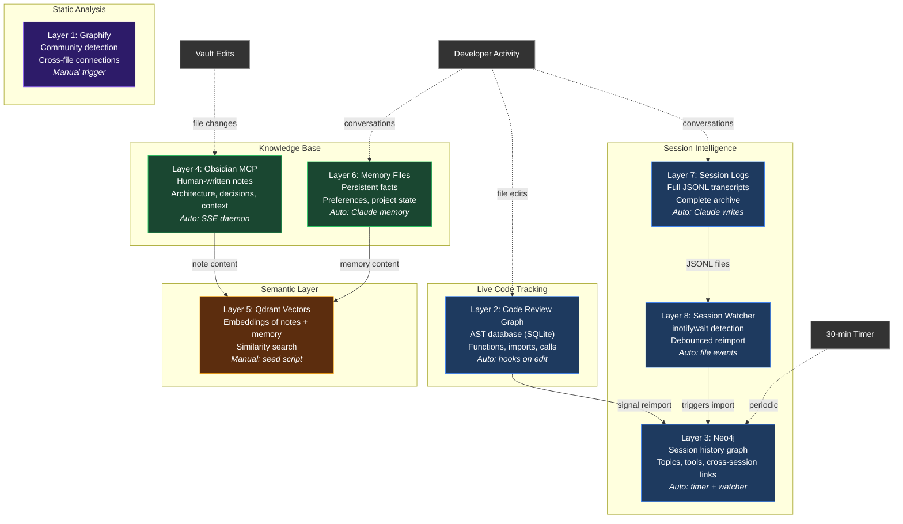

# Architecture Overview

## Color Legend

| Color | Meaning |
|-------|---------|
| Purple | Static analysis (run on demand) |
| Blue | Automated, event-driven |
| Green | Knowledge base (human + AI authored) |
| Orange | Semantic / embedding layer |
| Gray | External triggers |
