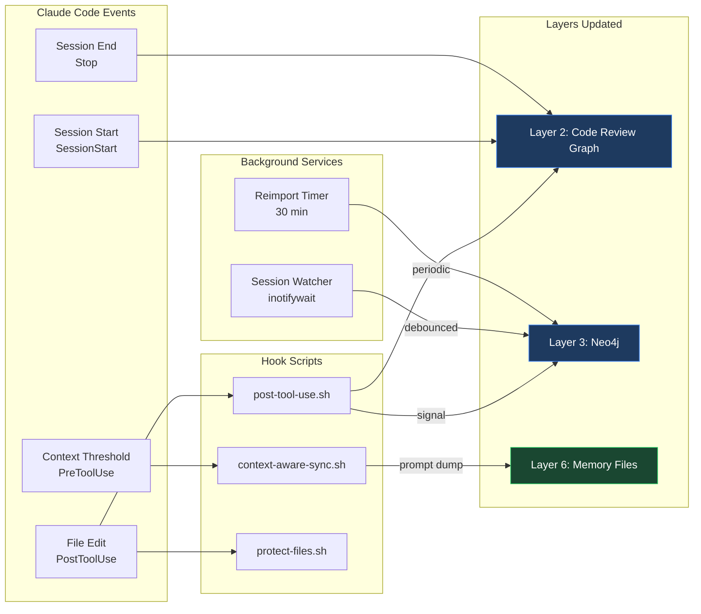

# Auto-Update Pipeline

The system uses Claude Code hooks, systemd timers, and filesystem watchers to keep 6 of 8 layers current without any manual intervention.

## Trigger Chain



## Hook Configuration

Hooks are defined in your project's `.claude/settings.json`:

```json
{
  "hooks": {
    "PostToolUse": [
      {
        "matcher": "Edit|Write",
        "command": ".claude/hooks/post-tool-use.sh"
      }
    ],
    "PreToolUse": [
      {
        "matcher": "Edit|Write",
        "command": ".claude/hooks/protect-files.sh"
      },
      {
        "matcher": ".*",
        "command": ".claude/hooks/context-aware-sync.sh"
      }
    ],
    "SessionStart": [
      {
        "command": "code-review-graph status"
      }
    ],
    "Stop": [
      {
        "command": "code-review-graph update"
      }
    ]
  }
}
```

## Trigger Reference Table

| Event | Hook/Service | Action | Layer(s) Affected | Latency |
|-------|-------------|--------|-------------------|---------|
| File edit (Edit/Write) | `post-tool-use.sh` | `code-review-graph update --skip-flows` | Layer 2 (CRG) | ~2-5s |
| File edit (Edit/Write) | `post-tool-use.sh` | Signal Neo4j reimport needed | Layer 3 (Neo4j) | Signal only |
| File edit (Edit/Write) | `protect-files.sh` | Block writes to .env/secrets | None (security gate) | <1s |
| Any tool use | `context-aware-sync.sh` | Check JSONL size, prompt knowledge dump | Layer 6 (Memory) | <1s |
| Session start | Hook | `code-review-graph status` | Layer 2 (CRG) | ~1s |
| Session end | Hook | `code-review-graph update` (full) | Layer 2 (CRG) | ~5-15s |
| JSONL file change | inotifywait (Layer 8) | Debounced reimport to Neo4j | Layer 3 (Neo4j) | 30s debounce |
| 30-minute interval | systemd timer | `make import-and-seed` | Layer 3 (Neo4j) | Periodic |
| Vault file change | basic-memory SSE | Re-index changed note | Layer 4 (Obsidian) | ~1-3s |
| Conversation learns fact | Claude auto-memory | Write/update memory file | Layer 6 (Memory) | Inline |
| Any conversation | Claude Code | Append to session JSONL | Layer 7 (Logs) | Inline |

## Manual Triggers (2 Layers)

| Layer | Command | When to Run |
|-------|---------|-------------|
| Layer 1: Graphify | `/graphify .` | After major refactoring or when you want a fresh architecture view |
| Layer 5: Qdrant | `python scripts/seed-vectors.py` | After adding new Obsidian notes or significant memory files |
