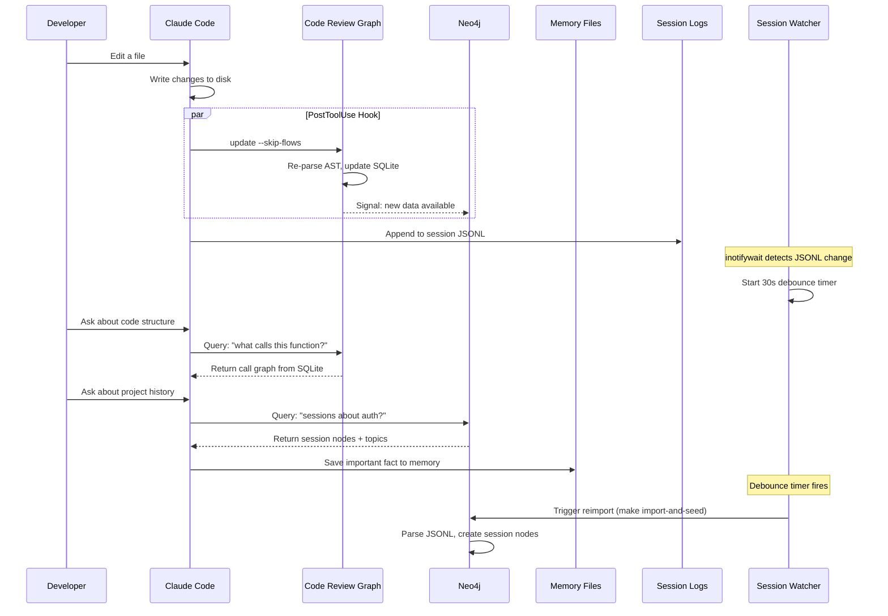
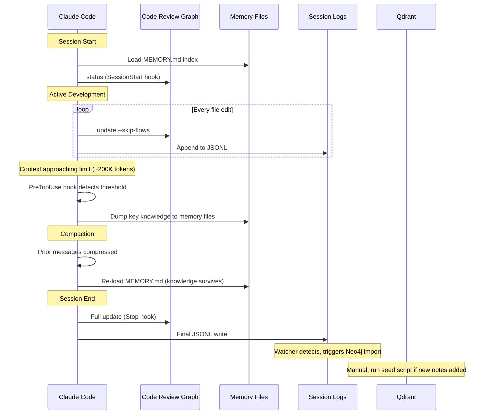

# Data Flow

How information moves through the 8-layer system during a typical development session.

## Normal Development Flow

## Session Lifecycle

## What Survives Context Compaction

| Layer | Survives? | How |
|-------|-----------|-----|
| 1. Graphify | Yes | Static files on disk — unaffected |
| 2. Code Review Graph | Yes | SQLite DB on disk — unaffected |
| 3. Neo4j | Yes | Docker volumes — unaffected |
| 4. Obsidian MCP | Yes | Vault files on disk — unaffected |
| 5. Qdrant | Yes | Vector DB on disk — unaffected |
| 6. Memory Files | **Yes, and auto-loads** | MEMORY.md reloaded after compaction |
| 7. Session Logs | Yes | JSONL on disk — raw transcript preserved |
| 8. Session Watcher | Yes | Systemd service — always running |

**The entire system is designed so that context compaction loses nothing permanent.** The conversation summary gets shorter, but all 8 layers retain their full content. Memory files are the key bridge — they load automatically and carry the most critical facts forward.
